# X-Ray classification


## TO-DOS

* Extract metrics
* Check other architectures
* Fine tune base model with Keras Tuner
* Other models for transfer learning
* Create py files for densenet and resnet models and build them to the notebooks
* Add cleaned notebooks to repo
* Write report

This project trains and evaluates different CNN architectures with the aim of image classification of the MURA dataset.

MURA is a dataset of musculoskeletal radiographs consisting of studies from 11,967 patients, with a total of 40,005 multi-view radiographic images. Each belongs to one of seven standard upper extremity radiographic study types: 
* elbow, 
* finger, 
* forearm, 
* hand,
* humerus, 
* shoulder, and 
* wrist. 

Each study is manually labeled as **normal** or **abnormal** by radiologists at the time of clinical radiographic interpretation in the diagnostic radiology environment between 2001 and 2012.

The **outcome** of the project is to feed the model with an image of an X-Ray and get as output the wether the patient has a normal or abnormal finding.

## Exploratory Data Analysis (EDA)

The dataset is already split in training and validation set. Training set consists of
36,808 images (92 %) and the validation set of 3,197 images (8 %). The distribution of these images to the seven types is not homogeneous, since i.e. in the training set we find more X-rays attributed to the shoulder and wrist and very few humerus or forearm X-rays. 

In all cases of the training set the negative/normal condition of the region are more then the positive/abnormal. At the validation set there are two cases (finger and forearm) where the abnormal diagnosis outcomes the normal.

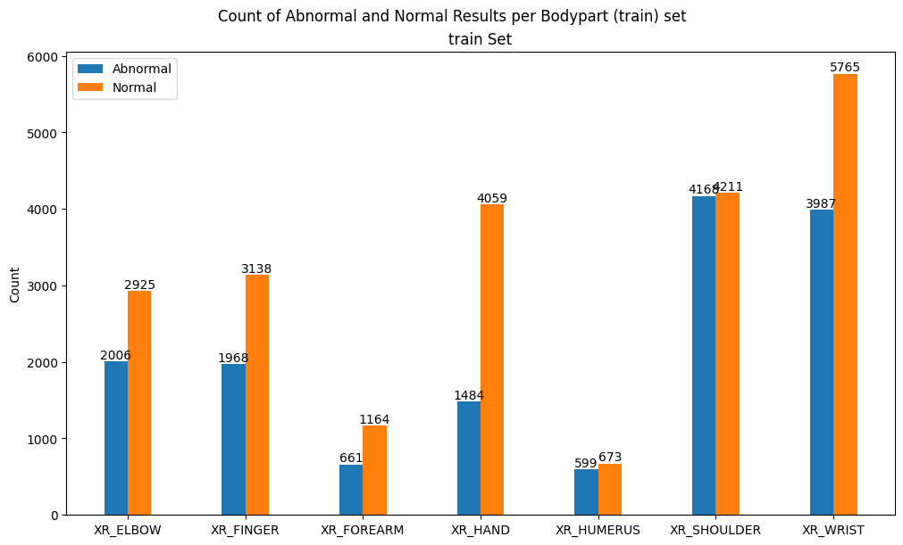

More insights on the data can be found in this [notebook](notebooks/EDA.ipynb).

## Architectures

### Base CNN model
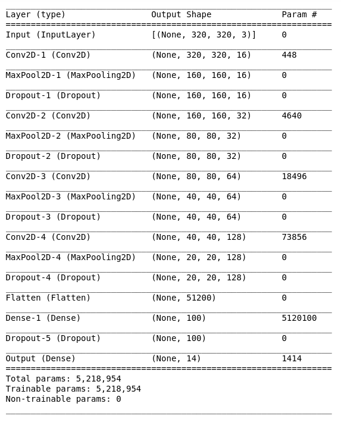

### Tranfer learning

#### DenseNet121 + 1 layer GlobalAveragePooling2D/dropout


#### ResNet152 + 1 layer GlobalAveragePooling2D/dropout

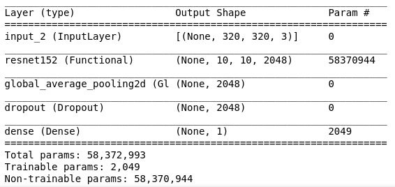

#### InceptionV3 + 1 layer GlobalAveragePooling2D/dropout

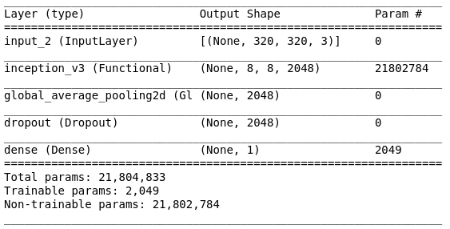

#### Xception + 1 layer GlobalAveragePooling2D/dropout

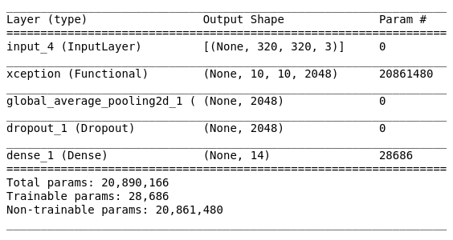

## Evaluation

### 14 cls approach

In this case each model was trained for all data, in order to identify not only whether the condition is normal or abnormal but also which body part, out of the 7 given the x-ray refers to. Below are the results of all 8 trained models.

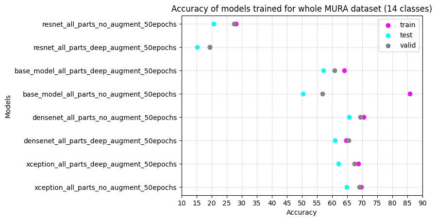

|     | name_code                                  |   train_accuracy_eval |   test_accuracy_eval |   valid_accuracy_eval|
|----:|:-------------------------------------------|----------------------:|---------------------:|----------------------:|
|  84 | xception_all_parts_no_augment_50epochs     |                 69.71 |                64.84 |                 68.95 |
|  85 | xception_all_parts_deep_augment_50epochs   |                 68.67 |                62.06 |                 67.41 |
|  86 | densenet_all_parts_deep_augment_50epochs   |                 64.73 |                60.9  |                 65.4  |
|  87 | densenet_all_parts_no_augment_50epochs     |                 70.56 |                65.71 |                 69.33 |
|  88 | base_model_all_parts_no_augment_50epochs   |                 85.81 |                50.3  |                 56.79 |
|  89 | base_model_all_parts_deep_augment_50epochs |                 64.1  |                57.12 |                 60.8  |
| 111 | resnet_all_parts_deep_augment_50epochs     |                 19.35 |                15.17 |                 19.33 |
| 112 | resnet_all_parts_no_augment_50epochs       |                 28.13 |                20.61 |                 27.41 |

### per body part

In this case each classifier is trained for each body part. The tables include the best 4 models per body part in regard to the highest accuracy on the test set.


#### Elbow

|     | name_code                       | part_body   |    lr |   conv_dropout |   callbacks_patience |   fit_epochs |   ealry_stop_at_epoch |   test_accuracy_eval |   train_accuracy_eval |   valid_accuracy_eval | model_name                                            |
|----:|:--------------------------------|:------------|------:|---------------:|---------------------:|-------------:|----------------------:|---------------------:|----------------------:|----------------------:|:------------------------------------------------------|
| 103 | densenet_deep_augment_70epochs  | XR_ELBOW    | 0.001 |          nan   |                   20 |           70 |                    40 |                77.85 |                 76.76 |                 77.8  | densenet_model_top_70epochs_deep_augment_XR_ELBOW.h5  |
|  76 | densenet_no_augment_100epochs   | XR_ELBOW    | 0.001 |            0.2 |                   20 |          100 |                    15 |                75.91 |                 76.69 |                 78.77 | densenet_model_top_100epochs_noaugment_XR_ELBOW.h5    |
|  96 | inception_deep_augment_70epochs | XR_ELBOW    | 0.001 |          nan   |                   20 |           70 |                    38 |                74.62 |                 77.59 |                 77.2  | inception_model_top_70epochs_deep_augment_XR_ELBOW.h5 |
|  13 | densenet_no_augment_20epochs    | XR_ELBOW    | 0.001 |          nan   |                   10 |           20 |                    20 |                73.12 |                 74.42 |                 73.31 | densenet_model_top_20epochs_noaugment_XR_ELBOW.h5     |
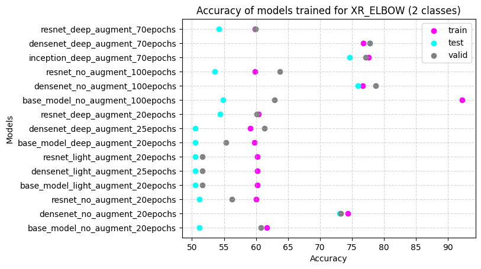

#### Finger

|     | name_code                       | part_body   |    lr |   conv_dropout |   callbacks_patience |   fit_epochs |   ealry_stop_at_epoch |   test_accuracy_eval |   train_accuracy_eval |   valid_accuracy_eval | model_name                                             |
|----:|:--------------------------------|:------------|------:|---------------:|---------------------:|-------------:|----------------------:|---------------------:|----------------------:|----------------------:|:-------------------------------------------------------|
|  12 | densenet_no_augment_20epochs    | XR_FINGER   | 0.001 |          nan   |                   10 |           20 |                    20 |                69.63 |                 68.91 |                 72.81 | densenet_model_top_20epochs_noaugment_XR_FINGER.h5     |
|  75 | densenet_no_augment_100epochs   | XR_FINGER   | 0.001 |            0.2 |                   20 |          100 |                    32 |                68.98 |                 77.1  |                 73.45 | densenet_model_top_100epochs_noaugment_XR_FINGER.h5    |
| 102 | densenet_deep_augment_70epochs  | XR_FINGER   | 0.001 |          nan   |                   20 |           70 |                    23 |                68.76 |                 70.57 |                 70.51 | densenet_model_top_70epochs_deep_augment_XR_FINGER.h5  |
|  95 | inception_deep_augment_70epochs | XR_FINGER   | 0.001 |          nan   |                   20 |           70 |                    36 |                68.55 |                 73.93 |                 76.09 | inception_model_top_70epochs_deep_augment_XR_FINGER.h5 |

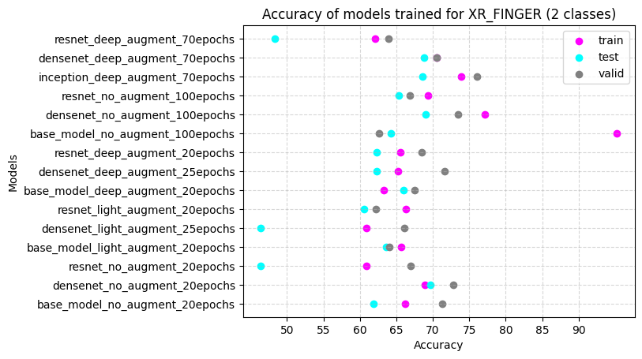


#### Forearm

|    | name_code                       | part_body   |    lr |   conv_dropout |   callbacks_patience |   fit_epochs |   ealry_stop_at_epoch |   test_accuracy_eval |   train_accuracy_eval |   valid_accuracy_eval | model_name                                              |
|---:|:--------------------------------|:------------|------:|---------------:|---------------------:|-------------:|----------------------:|---------------------:|----------------------:|----------------------:|:--------------------------------------------------------|
| 91 | inception_deep_augment_70epochs | XR_FOREARM  | 0.001 |          nan   |                   20 |           70 |                    70 |                79.07 |                 84.63 |                 82.12 | inception_model_top_70epochs_deep_augment_XR_FOREARM.h5 |
| 71 | densenet_no_augment_100epochs   | XR_FOREARM  | 0.001 |            0.2 |                   20 |          100 |                    30 |                73.09 |                 81.56 |                 81.82 | densenet_model_top_100epochs_noaugment_XR_FOREARM.h5    |
| 98 | densenet_deep_augment_70epochs  | XR_FOREARM  | 0.001 |          nan   |                   20 |           70 |                    42 |                73.09 |                 81.09 |                 84.44 | densenet_model_top_70epochs_deep_augment_XR_FOREARM.h5  |
|  8 | densenet_no_augment_20epochs    | XR_FOREARM  | 0.001 |          nan   |                   10 |           20 |                    20 |                68.77 |                 77.08 |                 72.73 | densenet_model_top_20epochs_noaugment_XR_FOREARM.h5     |

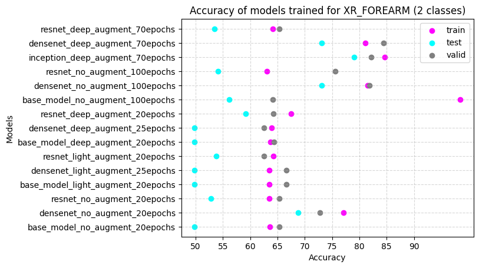

#### Hand

|     | name_code                        | part_body   |    lr |   conv_dropout |   callbacks_patience |   fit_epochs |   ealry_stop_at_epoch |   test_accuracy_eval |   train_accuracy_eval |   valid_accuracy_eval | model_name                                           |
|----:|:---------------------------------|:------------|------:|---------------:|---------------------:|-------------:|----------------------:|---------------------:|----------------------:|----------------------:|:-----------------------------------------------------|
|  94 | inception_deep_augment_70epochs  | XR_HAND     | 0.001 |          nan   |                   20 |           70 |                    63 |                68.04 |                 78.07 |                 79.81 | inception_model_top_70epochs_deep_augment_XR_HAND.h5 |
|  46 | base_model_deep_augment_20epochs | XR_HAND     | 0.001 |            0.2 |                    4 |           20 |                    10 |                65.95 |                 73.69 |                 68.95 | model_cnn_20epochs_deep_augment_XR_HAND.h5           |
|  74 | densenet_no_augment_100epochs    | XR_HAND     | 0.001 |            0.2 |                   20 |          100 |                    13 |                64.78 |                 76.26 |                 81.04 | densenet_model_top_100epochs_noaugment_XR_HAND.h5    |
| 101 | densenet_deep_augment_70epochs   | XR_HAND     | 0.001 |          nan   |                   20 |           70 |                    39 |                64.78 |                 77.36 |                 75.57 | densenet_model_top_70epochs_deep_augment_XR_HAND.h5  |

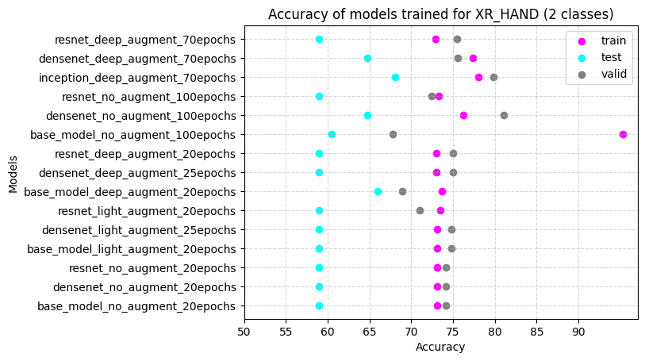

#### Humerus

|    | name_code                       | part_body   |    lr |   conv_dropout |   callbacks_patience |   fit_epochs |   ealry_stop_at_epoch |   test_accuracy_eval |   train_accuracy_eval |   valid_accuracy_eval | model_name                                              |
|---:|:--------------------------------|:------------|------:|---------------:|---------------------:|-------------:|----------------------:|---------------------:|----------------------:|----------------------:|:--------------------------------------------------------|
| 99 | densenet_deep_augment_70epochs  | XR_HUMERUS  | 0.001 |          nan   |                   20 |           70 |                    32 |                83.33 |                 78.12 |                 67.2  | densenet_model_top_70epochs_deep_augment_XR_HUMERUS.h5  |
| 92 | inception_deep_augment_70epochs | XR_HUMERUS  | 0.001 |          nan   |                   20 |           70 |                    52 |                82.64 |                 80.3  |                 79.2  | inception_model_top_70epochs_deep_augment_XR_HUMERUS.h5 |
| 72 | densenet_no_augment_100epochs   | XR_HUMERUS  | 0.001 |            0.2 |                   20 |          100 |                    38 |                80.21 |                 82.57 |                 73.85 | densenet_model_top_100epochs_noaugment_XR_HUMERUS.h5    |
|  9 | densenet_no_augment_20epochs    | XR_HUMERUS  | 0.001 |          nan   |                   10 |           20 |                    20 |                73.61 |                 71.55 |                 68.25 | densenet_model_top_20epochs_noaugment_XR_HUMERUS.h5     |

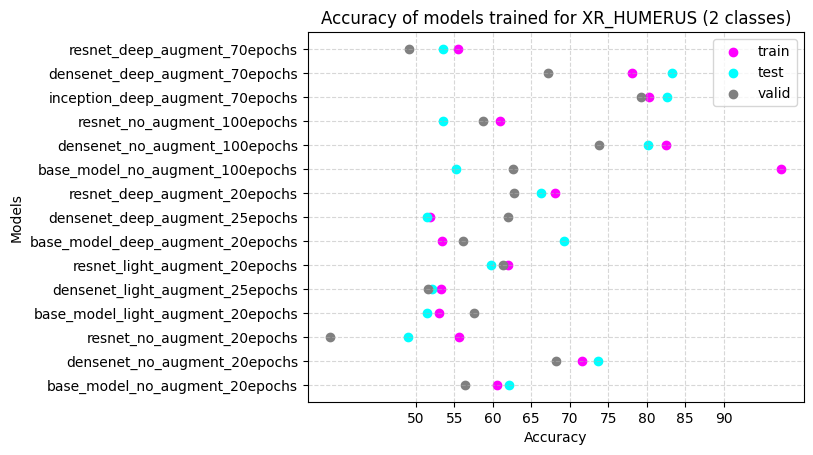

#### Shoulder

|    | name_code                       | part_body   |    lr |   conv_dropout |   callbacks_patience |   fit_epochs |   ealry_stop_at_epoch |   test_accuracy_eval |   train_accuracy_eval |   valid_accuracy_eval | model_name                                               |
|---:|:--------------------------------|:------------|------:|---------------:|---------------------:|-------------:|----------------------:|---------------------:|----------------------:|----------------------:|:---------------------------------------------------------|
| 90 | inception_deep_augment_70epochs | XR_SHOULDER | 0.001 |          nan   |                   20 |           70 |                    28 |                72.11 |                 72.08 |                 71.05 | inception_model_top_70epochs_deep_augment_XR_SHOULDER.h5 |
| 97 | densenet_deep_augment_70epochs  | XR_SHOULDER | 0.001 |          nan   |                   20 |           70 |                    37 |                71.4  |                 70.35 |                 71.02 | densenet_model_top_70epochs_deep_augment_XR_SHOULDER.h5  |
| 70 | densenet_no_augment_100epochs   | XR_SHOULDER | 0.001 |            0.2 |                   20 |          100 |                    32 |                70.52 |                 72.89 |                 75.56 | densenet_model_top_100epochs_noaugment_XR_SHOULDER.h5    |
| 63 | base_model_no_augment_100epochs | XR_SHOULDER | 0.001 |            0.2 |                   20 |          100 |                    14 |                66.61 |                 96.23 |                 63.64 | model_cnn_100epochs_noaugment_XR_SHOULDER.h5             |

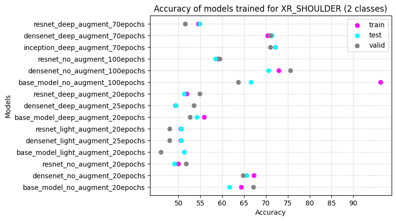

#### Wrist

|     | name_code                       | part_body   |    lr |   conv_dropout |   callbacks_patience |   fit_epochs |   ealry_stop_at_epoch |   test_accuracy_eval |   train_accuracy_eval |   valid_accuracy_eval | model_name                                            |
|----:|:--------------------------------|:------------|------:|---------------:|---------------------:|-------------:|----------------------:|---------------------:|----------------------:|----------------------:|:------------------------------------------------------|
|  73 | densenet_no_augment_100epochs   | XR_WRIST    | 0.001 |            0.2 |                   20 |          100 |                    45 |                78.15 |                 80.61 |                 80.67 | densenet_model_top_100epochs_noaugment_XR_WRIST.h5    |
|  93 | inception_deep_augment_70epochs | XR_WRIST    | 0.001 |          nan   |                   20 |           70 |                    64 |                77.24 |                 79.01 |                 80.15 | inception_model_top_70epochs_deep_augment_XR_WRIST.h5 |
| 100 | densenet_deep_augment_70epochs  | XR_WRIST    | 0.001 |          nan   |                   20 |           70 |                    39 |                74.36 |                 76.83 |                 76.48 | densenet_model_top_70epochs_deep_augment_XR_WRIST.h5  |
|  10 | densenet_no_augment_20epochs    | XR_WRIST    | 0.001 |          nan   |                   10 |           20 |                    20 |                74.05 |                 76.2  |                 77.21 | densenet_model_top_20epochs_noaugment_XR_WRIST.h5     |


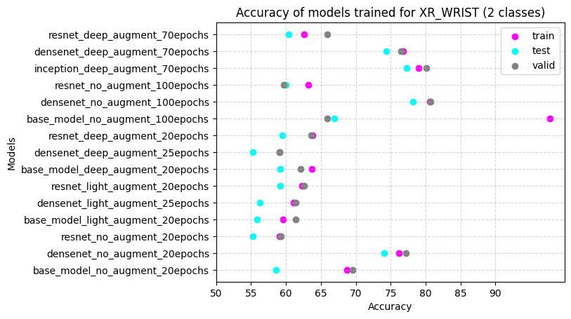


## Getting Started


### Jupyter Notebook

All [notebooks](notebooks/) were developed in Python 3.8.10.

### Scripts

All scripts of [models](models/) and [libraries](lib/)were developed in Python 3.7.3.


To install all packages in the version used here:

```
pip install -r requirements.txt
```


## Use application

You can use the application as following:

```
git clone git@github.com:aandrovitsanea/cnn_mura.git
cd cnn_mura
```
Then either take an ipython shell or open a jupyter notebook in there.

```
import lib.prediction as predict

# If dealing with the binary problem

prediction = predict.calculate_binary(name_code,
                                        part_body,
                                        image_url)
                                
# If you don't know the category the x-ray belongs to

prediction = predict.calculate_14cls(name_code,
                                        part_body,
                                        image_url)

```
`name_code`, `part_body` and `image_url` params must be passed as strings.

Example:

```
pred = predict.calculate_binary('densenet_model_top_70epochs_deep_augment',
                                'XR_HUMERUS',
                                'data/MURA-v1.1/valid/XR_HUMERUS/patient11641/study2_positive/image1.png')

Output: X-ray of XR_HUMERUS is abnormal.
``` 
Only the best model per body part and for all 14 cls are included in the repo. All h5 are available upon request. Just send me an [email](anna.androvitsanea@gmail.com).


